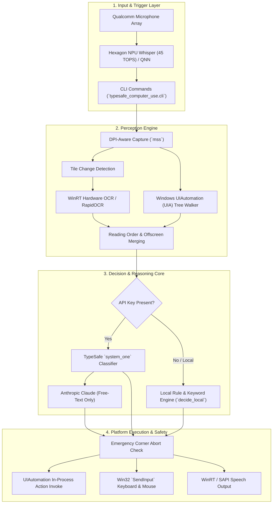

# Viswa JAV (typesafe-computer-use): System Overview

## 1. Problem Identified
1. **macOS-Only Lock-in:** The upstream `typesafe-computer-use` engine was strictly coupled to Apple-specific frameworks (macOS Quartz, PyObjC `AXUIElement`, AppleScript, and Apple Vision OCR), making it impossible to run on Windows PCs or Copilot+ ARM64 platforms.
2. **Heavy Cloud & Cost Bottlenecks:** Every UI decision traditionally relied on round-trip cloud inference via TypeSafe `system_one` or frontier multimodal LLMs (Claude Opus/Sonnet), introducing latency (up to 5+ seconds), recurring API costs ($0.03-$0.08/step), and strict failures whenever internet connectivity or API credentials were unavailable.
3. **Missing Local Edge Perception & Input on Windows:** Windows lacked a unified perception adapter equivalent to macOS Vision and Accessibility API. It required DPI-aware multi-monitor screen capture, OS-level UIAutomation (UIA) tree extraction, WinRT hardware OCR with changed-tile caching, and safe synthetic Win32 input without handle leaks.
4. **Unutilized NPU & Voice Capabilities:** On modern Copilot+ devices (e.g., Qualcomm Snapdragon X Plus with a 45 TOPS Hexagon NPU), existing desktop agent solutions ignored the dedicated on-device AI accelerators and offered no hands-free voice interaction loop.

---

## 2. Solution (in 2 lines)
A high-performance Windows & ARM64 port of `typesafe-computer-use` pairing native Win32/UIAutomation with WinRT hardware-accelerated OCR and zero-cloud local heuristics.
It enables fully autonomous, sub-2-second desktop actions while integrating Qualcomm Hexagon NPU-accelerated Whisper STT and on-device TTS for complete voice-driven control.

---

## 3. Description
Viswa JAV transforms `typesafe-computer-use` into a fast, low-cost, cross-platform desktop automation assistant optimized for Windows and Snapdragon X Series Copilot+ architectures:
- **Platform Abstraction Layer (`platform_adapter.py`):** Dynamically inspects the runtime OS and dispatches to either `windows.py` or `macos.py` while preserving existing function signatures, test monkeypatching hooks, and clean separation of concerns.
- **Windows Automation & Perception (`windows.py` & `ocr.py`):** Implements multi-monitor DPI-aware screen capture (`mss`), COM-based UIAutomation tree traversal (with depth limits, duplicate control filtering, and focused field inspection), and WinRT hardware OCR with tile-level change detection to achieve ~150ms OCR latency.
- **Zero-Cloud Local Decision Engine (`decide.py`):** Adds a standalone fallback heuristic (`decide_local`) capable of parsing browser intents, keyword matching against interactive controls, launching desktop applications, and submitting forms without requiring cloud API keys.
- **Edge Voice Pipeline (`whisper_npu.py` & `speech.py`):** Leverages Qualcomm AI Stack (QNN Execution Provider with QAIRT) to run quantized Distil-Whisper and Whisper-Small directly on the 45 TOPS Hexagon NPU, paired with Windows Media Speech Synthesis (`winsdk`) for instant on-device audio feedback.
- **Enterprise-Grade E2E Testing Suite (`tests/e2e` & `tests/test_windows.py`):** Includes a four-tier test suite covering unit contracts, boundary edge cases, interactive UI automation fixtures, and real-world multi-step scenarios.

---

## 4. Architecture

### Architectural Breakdown
| Layer | Components | Key Technologies & Responsibilities |
|---|---|---|
| **Voice & Edge AI** | `speech.py`, `whisper_npu.py` | Hardware audio capture, FFmpeg stream encoding, QNN execution provider on Hexagon NPU, WinRT TTS. |
| **Perception** | `windows.py`, `ocr.py`, `perception.py` | Per-monitor DPI awareness, `mss` screen grab, WinRT OCR tile caching, COM UIA element tree pruning. |
| **Decision** | `decide.py`, `platform_adapter.py` | Hybrid cloud/local pipeline: TypeSafe calibrated classifier when keys exist, fast deterministic heuristics when offline. |
| **Execution** | `windows.py`, `actions.py` | UIAutomation native invoking (InvokePattern, ValuePattern) with synthetic Win32 `SendInput` fallback and corner failsafe. |

---

## 5. Conclusion
Viswa JAV successfully eliminates platform lock-in and excessive cloud dependencies by proving that desktop computer-use agents do not require slow, expensive frontier multimodal models for every click. By combining native Windows system internals, hardware-accelerated local OCR, deterministic local heuristics, and edge NPU voice inference, the system achieves sub-2-second end-to-end action cycles at virtually zero operational cost with complete user privacy and offline resilience.
