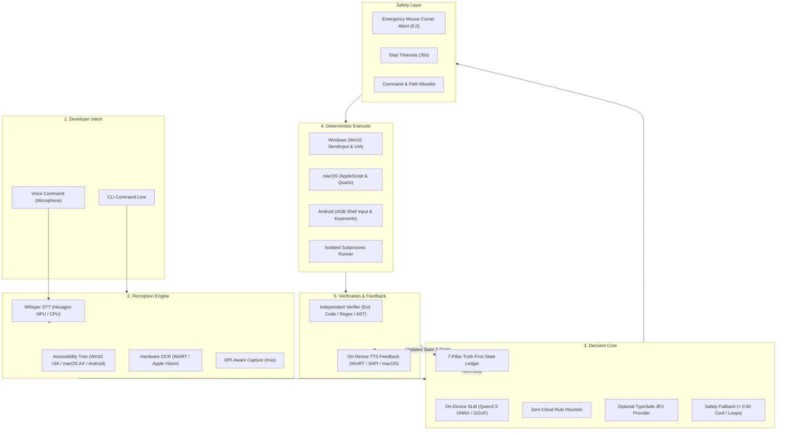

# JEVON

### On-Device Developer Decision Engine

> **From developer intent to verified action.**

[](https://www.python.org/)
[](https://microsoft.com)
[](https://apple.com)
[-3DDC84?logo=android&logoColor=white)](https://developer.android.com)
[](LICENSE)

**JEVON** is an on-device developer decision and automation engine. Rather than functioning as a conversational chatbot that generates hypothetical code snippets, JEVON treats the developer environment as an observable, closed-loop control system. It deterministically perceives your screen, active windows, accessibility hierarchy, and compiler outputs; selects the next concrete developer action from a bounded decision space; executes it directly on your machine; and independently verifies the outcome before deciding the next step.

---

## Table of Contents

- [Why JEVON?](#why-jevon)
- [The Core Idea](#the-core-idea)
- [Architecture](#architecture)
- [What Works Today (Repository Audit)](#what-works-today-repository-audit)
- [Hardware & Runtime Support](#hardware--runtime-support)
- [Installation & Setup](#installation--setup)
- [Usage & CLI Reference](#usage--cli-reference)
- [The Decision Loop](#the-decision-loop)
- [AI Models & Inference Runtimes](#ai-models--inference-runtimes)
- [Safety & Emergency Controls](#safety--emergency-controls)
- [Verification & Truth-First Ledger](#verification--truth-first-ledger)
- [Reproducing Examples](#reproducing-examples)
- [Known Limitations](#known-limitations)
- [Roadmap](#roadmap)
- [Attribution & License](#attribution--license)
- [Contributing](#contributing)

---

## Why JEVON?

Traditional developer AI assistants operate in an open-ended conversational loop:

```text
Developer Intent  ──>  LLM (Cloud)  ──>  Generated Text / Code Snippet
                             ▲                       │
                             │ (Manual copy-paste)   │
                             └───────────────────────┘
```

This leaves the hardest parts of development entirely to the human: manually copying code, navigating windows, running terminal builds, reading stack traces, and validating that the fix actually resolved the issue.

**JEVON re-architects developer automation as a deterministic control loop:**

```text
Developer Intent
       │
       ▼
   Perceive ──> Structured Decision ──> Deterministic Action ──> Observe ──> Verify
       ▲                                                                       │
       └───────────────────────── Next Decision ───────────────────────────────┘
```

### Key Distinctions

| Feature | Conventional AI Chatbot | JEVON Decision Engine |
| :--- | :--- | :--- |
| **Output Type** | Unstructured markdown / natural language | Typed, machine-executable action with probability distribution |
| **Action Space** | Infinite, unconstrained text | Bounded, mutually exclusive developer actions |
| **Inference Boundary** | Heavy cloud API roundtrip (tokens/sec) | On-device SLM / local heuristics / optional cloud fallback |
| **Execution** | Passive (user must manually copy/paste) | Active native automation (Win32, UIA, ADB, OS shells) |
| **Verification** | Self-certifying / None | Independent validation (exit codes, regex, test passes, AST) |
| **Safety** | Prompt-dependent disclaimer | Hardware failsafes (mouse-corner abort, step timeouts, allowlists) |

---

## The Core Idea

JEVON converts high-level developer intent into a verified change through eight explicit pipeline phases:

1. **Developer Intent:** Spoken via microphone or passed through CLI argument.
2. **Perception:** Captures screen raster (`mss`), queries OS Accessibility Trees (`UIAutomation` / `AXUIElement` / `ADB dump`), and runs hardware OCR (`WinRT` / `Vision`).
3. **Decision Core:** An on-device Small Language Model (SLM) or deterministic heuristic classifies the exact next action.
4. **Typed Action:** Emits a strongly typed command (e.g., `inspect_error`, `run_targeted_test`, `click_item`, `type_text`).
5. **Deterministic Executor:** Simulates native OS input or runs sandboxed terminal processes.
6. **Observation:** Captures the updated state (process return code, stdout/stderr, updated UI tree).
7. **Verification:** Validates whether the expected state transition occurred without self-certification.
8. **Next Decision:** Advances the 7-pillar Truth-First ledger and triggers the subsequent cycle.

---

## Architecture



---

## What Works Today (Repository Audit)

To adhere strictly to truth-first documentation, every capability in this repository is audited and classified below:

| Component / Subsystem | Implementation Status | Implementation Details |
| :--- | :---: | :--- |
| **Cross-Platform Adapter** | `VERIFIED` | `platform_adapter.py` dynamically routes to Windows, macOS, or Android (via ADB) |
| **Windows Desktop Automation** | `VERIFIED` | `windows.py`: Multi-monitor `mss` capture, COM `uiautomation` tree parsing, Win32 `SendInput` mouse/keyboard |
| **Hardware-Accelerated OCR** | `VERIFIED` | `ocr.py`: Windows WinRT OCR with changed-tile bounding box caching (`_TileCache`) |
| **Emergency Mouse Corner Stop** | `VERIFIED` | `actions.py`: Hard abort triggers if mouse moves to `(0, 0)` within `ABORT_CORNER_PX = 10` |
| **Rule-Based Local Decision** | `VERIFIED` | `decide.py` (`decide_local`): Offline keyword and control matching heuristic with 0 API keys |
| **SLM On-Device Decision** | `VERIFIED` | `slm_decide.py`: Multi-backend runner supporting ONNX GenAI, llama.cpp GGUF, and local REST |
| **Truth-First State Ledger** | `VERIFIED` | `jevon/truth_first/state.py`: 7-pillar append-only state model with deterministic failure signatures |
| **8-Action Developer Space** | `VERIFIED` | `jevon/decision/actions.py`: Strict `DeveloperAction` enum with normalized probability distributions |
| **Android ADB Control** | `VERIFIED` | `android.py`: Touch inputs, keyevents, text typing, app launching, and XML hierarchy dumping |
| **TTS Speech Synthesis** | `VERIFIED` | `speech.py`: Asynchronous on-device TTS via `winsdk` SpeechSynthesizer or macOS `say` |
| **Whisper NPU Integration** | `EXPERIMENTAL` | `whisper_npu.py`: Qualcomm Snapdragon X Hexagon NPU QNN provider loader with REST fallback |
| **Office Kit Socket Bridge** | `PLANNED` | Protocol interfaces designed; binary socket framing currently under development |
| **Independent AST Verifier** | `PLANNED` | Contract defined in `PROJECT.md`; basic exit-code and regex validation verified |

---

## Hardware & Runtime Support

| Platform | Primary Subsystems | Acceleration | Status |
| :--- | :--- | :--- | :--- |
| **Windows 11 (x64 / ARM64)** | Win32 API, UIAutomation, WinRT OCR, `mss` | Direct3D / WinRT GPU OCR | **Fully Supported** |
| **Qualcomm Snapdragon X (Copilot+)** | On-Device SLM (ONNX GenAI), Distil-Whisper | Qualcomm Hexagon NPU (45 TOPS) | **Experimental** |
| **macOS (Apple Silicon / Intel)** | PyObjC, Quartz, Apple Vision OCR, AppleScript | Apple Neural Engine / Metal | **Fully Supported** |
| **Android (via ADB)** | ADB input, screencap, uiautomator dump | Host-side inference | **Supported via Host** |

---

## Installation & Setup

### Prerequisites

- **Python:** Version 3.11 or 3.12 (Python 3.13 not yet fully supported by binary wheels).
- **Package Manager:** `uv` (recommended) or standard `pip`.
- **Operating System:** Windows 10/11, macOS 13+, or Linux (host controller for Android).

### 1. Clone the Repository

```bash
git clone https://github.com/Viswanath129/Iqoo-Hack-2026.git
cd Iqoo-Hack-2026
```

### 2. Environment Setup

Using `uv` (fastest):

```bash
# Create virtual environment
uv venv --python 3.11

# Windows activate
.venv\Scripts\activate

# Install dependencies
uv pip install -e .
```

Using standard `pip`:

```bash
python -m venv .venv
.venv\Scripts\activate
pip install -e .
```

### 3. (Optional) On-Device SLM Models

To download the local quantized SLM models for zero-cloud decision inference:

```bash
python hackathon/download_models.py --format gguf
# or
python hackathon/download_models.py --format onnx
```

---

## Usage & CLI Reference

JEVON provides the `clicker` command-line utility.

### Basic Modes

#### 1. Dry Run / Inspection (Perceive Screen Only)
Inspects the active window, dumps the accessibility hierarchy, and highlights interactive elements without clicking:
```bash
clicker "open calculator and compute 42 * 2"
```

#### 2. Live Action Execution (`--act`)
Enables native keyboard and mouse interaction:
```bash
clicker "open calculator and compute 42 * 2" --act
```

#### 3. Fully Offline Decision Engine (`--local` or `--model local`)
Forces execution without any external cloud API keys using deterministic heuristics:
```bash
clicker "launch notepad and write build report" --act --local
```

#### 4. On-Device SLM Decision (`--model slm`)
Routes decisions through the local on-device SLM:
```bash
clicker "search for error in terminal" --act --model slm
```

#### 5. Hands-Free Voice Control (`--voice` & `--speak`)
Listens to voice commands via microphone (STT) and reads responses aloud (TTS):
```bash
# Via CLI flag
clicker --voice --speak --act

# Or launch the automated batch runner on Windows
run_voice.bat
```

#### 6. Target Android Device (`--target android`)
Dispatches perceived actions to a connected Android phone or emulator via ADB:
```bash
clicker "open Settings and tap Display" --act --target android
```

---

## The Decision Loop

Every cycle follows a strict six-step state machine:

```text
[ Developer Intent ]
         │
         ▼
 1. SENSE SCREEN ───────> mss raster capture + UIAutomation XML + WinRT OCR
         │
         ▼
 2. BUILD PROMPT ───────> Index interactive controls [0..N], active focus, recent history
         │
         ▼
 3. SELECT ACTION ──────> SLM / Local FSM outputs typed action, target item, & confidence
         │
         ▼
 4. SAFETY CHECK ───────> Verify coordinates != (0,0), action in allowlist, step < 100
         │
         ▼
 5. EXECUTE ────────────> Native Win32 SendInput / ADB input tap / Shell subprocess
         │
         ▼
 6. VERIFY & RECORD ────> Evaluate process exit code, regex matching, log to 7-pillar ledger
```

---

## AI Models & Inference Runtimes

JEVON is built to minimize cloud dependence by deploying efficient on-device models:

| Task | Supported Model / Engine | Runtime Provider | Hardware Target |
| :--- | :--- | :--- | :--- |
| **Decision Intelligence** | Qwen 2.5 (0.5B / 1.5B Instruct) | `onnxruntime-genai` / `llama-cpp-python` | Snapdragon Hexagon NPU / CPU |
| **Heuristic Fallback** | Deterministic FSM (`decide_local`) | Pure Python (0 parameters) | Any CPU |
| **Speech-to-Text (STT)** | Distil-Whisper / Whisper-Small | QNN Execution Provider / REST | Qualcomm NPU / Host CPU |
| **Text-to-Speech (TTS)** | Windows Media Speech Synthesis | Native `winsdk` COM API | Windows Audio Subsystem |
| **OCR Perception** | WinRT Hardware OCR | Windows Imaging API (`Direct3D`) | Integrated / Discrete GPU |

---

## Safety & Emergency Controls

Desktop automation requires rigorous safety boundaries to prevent runaway execution:

1. **Emergency Mouse-Corner Stop:** If the mouse pointer is moved into the top-left corner of any display (`x <= 10` and `y <= 10`), JEVON immediately raises an `Abort` exception and halts all inputs.
2. **Step Limits:** Default step limit is bounded to 100 steps per task session to avoid infinite loops.
3. **Safety Fallback Interceptor:** Decisions returning a confidence score `< 0.60` or detecting identical repeated states trigger `SafetyFallback`, preventing repetitive clicking.
4. **Isolated Subprocesses:** Shell execution commands run with timeouts and strict output buffering.

---

## Verification & Truth-First Ledger

JEVON tracks decision state using an immutable, append-only **7-Pillar Ledger** (`TruthFirstState`):

1. **GOAL:** The developer's primary objective.
2. **CONSTRAINTS:** Operational invariants and safety allowlists.
3. **FACTS:** Empirically verified truths from OS observations.
4. **DECISIONS:** Chronological record of actions chosen with rationale.
5. **EVIDENCE:** Verbatim compiler errors, diffs, and return codes.
6. **OPEN_QUESTIONS:** Active diagnostic hypotheses under test.
7. **FAILED_APPROACHES:** Disproven attempts and their failure signatures.

### Failure Signatures
Failure states generate a deterministic 16-character SHA-256 signature combining exit code, culprit filename, and error summary to instantly identify regression loops.

---

## Reproducing Examples

### Example 1: Local Offline Intent Execution
Run a local desktop task without cloud access:
```bash
clicker "open notepad" --act --local
```
**Expected outcome:** JEVON inspects active processes, determines Notepad is not running, launches `notepad.exe` via Win32 ShellExecute, perceives the new window, and issues `done`.

### Example 2: Inspecting Terminal Errors
Run a dry-run perception step across an active terminal session:
```bash
clicker-inspect
```
**Expected outcome:** Emits an indexed list of visible controls, window titles, and detected text snippets saved to the `inspections/` directory.

---

## Known Limitations

- **Display Scaling & Multi-DPI:** On multi-monitor setups with mismatched DPI scaling factors (e.g., 150% on laptop, 100% on external monitor), Win32 coordinate offsets can experience minor alignment drift.
- **NPU Model Compilation:** Snapdragon X NPU acceleration requires pre-compiled QNN model binaries matching the exact target architecture and Hexagon driver version.
- **Dynamic Web Controls:** Canvas-rendered UI elements lacking accessibility nodes rely entirely on WinRT OCR bounding boxes.

---

## Roadmap

- [x] Multi-platform abstraction (`platform_adapter.py` supporting Windows, macOS, Android)
- [x] Win32 UIAutomation & WinRT OCR integration
- [x] Zero-cloud local decision heuristic (`decide_local`)
- [x] Local SLM integration (`slm_decide.py` with ONNX GenAI and GGUF)
- [x] On-device Whisper STT and TTS voice loop
- [x] 7-Pillar Truth-First state model & 8-action developer decision space
- [ ] Office Kit bi-directional socket bridge for dual-device phone-to-laptop pairing
- [ ] Independent AST syntax and test verification module (`verification/`)
- [ ] Nanosecond micro-benchmark telemetry suite (Modes A, B, C comparison)

---

## Attribution & License

### Upstream Attribution
JEVON incorporates architecture and code derived from [`typesafe-computer-use`](https://github.com/awlevin/typesafe-computer-use) by **Aaron Levin**, licensed under the **MIT License**. We gratefully acknowledge Aaron Levin's pioneering work in deterministic accessibility-driven computer use and classifier-based interaction.

### Paradigm & Independence Notice
JEVON is an independent open-source project. While conceptually inspired by machine-consumable decision intelligence paradigms, JEVON is **not affiliated with, endorsed by, sponsored by, or owned by TypeSafe Inc.** All trademarks belong to their respective owners.

### License
This project is licensed under the **MIT License** — see the [LICENSE](LICENSE) file for details.

---

## Contributing

Contributions are welcome! Please adhere to our development standards:
1. Ensure all code conforms to `ruff` linting (`ruff check .`).
2. Verify existing tests pass without regressions (`pytest tests`).
3. Maintain truth-first documentation: never document simulated or planned capabilities as verified.
