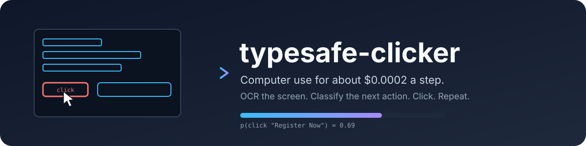

<p align="center">
  
</p>

<p align="center">
  <a href="https://github.com/awlevin/typesafe-computer-use/actions/workflows/ci.yaml"></a>
  <a href="LICENSE"></a>
  
  
  <a href="https://docs.typesafe.ai"></a>
  <a href="https://github.com/astral-sh/ruff"></a>
</p>

**typesafe-computer-use** drives a Mac toward a goal you type in plain English, for about a
fiftieth of a cent per step. It never sends a screenshot to a big model. Instead it
reads the screen deterministically, asks a small classifier which action comes next,
and only calls a writing model when a text field genuinely needs free text.

```
clicker "go to techcrunch and take me to the checkout page for the cheapest tickets to their next upcoming event" --act
```

## Why

Frontier-model computer use is capable and expensive: every step ships a screenshot and
waits several seconds for a plan. Most steps do not need a plan. They need one choice
from a short list, made quickly and cheaply, with a confidence number you can gate on.

[TypeSafe](https://docs.typesafe.ai) sells exactly that: a decision model that answers
a `Choice` over up to 255 options with a full probability distribution and a calibrated
confidence, in a few hundred milliseconds, with free output tokens. This project is a
computer-use loop built around it.

Measured on the same screenshot and goal, one decision each:

| | typesafe (jev) | Claude Opus 5, bare screenshot | multiplier |
|---|---|---|---|
| input tokens | 4,882 | 4,785 | same |
| cost per decision | $0.0002 | $0.032 | 155x cheaper |
| cost per decision, realistic loop with history | $0.0002 | $0.035 to $0.08 | 170x to 390x cheaper |
| cost per 12-step task | $0.003 | $0.40 to $0.90 | 130x to 300x cheaper |
| model latency | 0.13 to 0.38 s | 5.2 s | 14x to 40x faster |
| end-to-end step, with capture and OCR | about 1.5 s | about 5.5 s | 3.7x faster |

The honest caveat: the big model read the event dates off the pixels and compared them
unaided. The classifier needed the date parsing described below. Every piece of
reasoning the frontier model does for free has to be rebuilt here as deterministic state.

## Install

macOS 14 or newer, Python 3.12 or newer, [uv](https://docs.astral.sh/uv/).

```
git clone https://github.com/awlevin/typesafe-computer-use
cd typesafe-computer-use
uv sync
cp .env.example .env     # fill in the keys
```

| variable | required | purpose |
|---|---|---|
| `TYPESAFE_API_KEY` | yes | every decision |
| `ANTHROPIC_API_KEY` | no | `type_text` and writer-proposed URLs |
| `CLICKER_EMAIL` | no | enables the `type_email` action |
| `CLICKER_BROWSER` | no | defaults to `Google Chrome` |
| `CLICKER_WRITER_MODEL` | no | defaults to `claude-haiku-4-5` |

Grant your terminal **Screen Recording** and **Accessibility** in System Settings >
Privacy & Security. Without the first, captures are wallpaper. Without the second,
synthetic clicks are silently dropped, and `--act` refuses to start.

## Use

```
uv run clicker "open the Playground"                 # dry run: one step, prints what it would do
uv run clicker "open the Playground" --act           # drives the machine, up to 12 steps
uv run clicker "log in" --act --steps 20 --delay 3   # longer and slower
uv run clicker-inspect "any goal"                    # 3-2-1, capture, open the annotated screen + payload
```

Clear the terminal first. It is on screen, so its text is OCR input.

**Stopping a live run.** Ctrl-C when the terminal has focus, or slam the mouse into the
top-left corner of the screen from any app. The loop also stops itself on `done` or
`none`, on confidence under `--min-confidence` (0.4), after two consecutive no-ops, or
at `--steps`.

## How a step works

```
screencapture ─► Vision OCR ─► merge lines into blocks ─► drop lines echoing the goal
accessibility ─► actionable elements (role, label, frame), pruned to the display
                     │
                     └─► one numbered list of items, each carrying its source
                     │
accessibility ─► focused field (role, label, placeholder, value, frame)
AppleScript   ─► frontmost app and pid, active tab URL
clock         ─► local date and time
dates.py      ─► "dated 2026-10-13 (in 27 days)" on any block containing a date,
                 "near a line dated ..." on its neighbours
                     │
                     ▼
        one TypeSafe request, three Choices
        ┌──────────────────────────────────────────────────────┐
        │ kind  : click_item | open_site | type_text | scroll… │
        │ item  : which item (used only for click_item)        │
        │ site  : which catalog site (used only for open_site) │
        └──────────────────────────────────────────────────────┘
                     │
                     ▼
        deterministic action ─► wait ─► next step
```

Items carry where they came from: `ocr` for a text block, `ax` for a control the app
declared, `ax+ocr` when both found the same thing. An `ax` item reads as
`button 'Share' (top-right)` in the criteria, so the classifier can tell a real control
from a line of text.

Splitting the decision into three questions keeps screen noise out of the action
choice. Every stall found while building this came from two options that meant the
same thing. Confidence measures concentration, so overlapping options always read as
doubt. Keep the action set mutually exclusive.

### Accessibility tree

OCR cannot see an icon. The accessibility tree can, so each step also walks the frontmost
process for labelled, on-screen controls. Coverage is uneven, measured on ten apps on one
Mac: Finder 100% of on-screen controls labelled, Chrome 88%, Slack 85%, Notion 68%,
Spotify 0 (its CEF shell exposes three window buttons and nothing else). Terminals expose
the grid as one text area. So AX is a bonus source, never a replacement.

Labels live in `AXDescription` for web and Electron, `AXTitle` for AppKit, and a short
`AXValue` otherwise. A decorative image takes the label of the control around it; a list
row takes it from a shallow `AXStaticText`.

Frames lie, so the walk prunes hard:

- skip any subtree whose real frame misses the display (Notes reports rows 200 screens
  down, Chrome parks scrolled-out nodes above the viewport)
- skip any node under 4 pt wide or tall (Chromium clamps scrolled-out web nodes to slivers)
- skip `AXMenu` subtrees, which are thousands of zero-sized items behind a closed menu
- skip nameless `AXGroup` layout boxes, even pressable ones
- stop at 4000 nodes or 0.6 s and say so

Walks measured here: Finder 152 controls in 0.08 s, Chrome 172 in 0.59 s. The assistive
handshake attributes (`AXManualAccessibility`, `AXEnhancedUserInterface`) are unsupported
on this macOS, so nothing relies on them.

### Action space

| key | does |
|---|---|
| `click_item` | click the center of the chosen item, converted from Retina pixels to points |
| `open_site` | AppleScript `open location` for a `SITES` catalog entry, or a URL the writer proposes |
| `switch_to_browser` | bring the browser forward to continue with a page already open there |
| `type_text` | the writer composes the string; a TypeSafe Noul then checks the field's value |
| `type_email` | types `$CLICKER_EMAIL`; refused unless a text field is focused |
| `press_enter`, `press_escape` | keyboard |
| `scroll_down`, `scroll_up` | 10 lines, after parking the cursor over the frontmost window |
| `wait` | screen still loading |
| `done`, `none` | stop |

### Where free text comes from

The classifier never generates text. The writer model runs in two places, each with a
small packet and a structured reply:

- **`type_text`** receives the goal, recent actions, the focused field's label and
  placeholder, and the OCR lines near the field. It returns `{fill, text}`. Credential
  fields come back `fill: false` and nothing is typed. After typing, a Noul scores
  whether the field now holds a sensible value. Under 0.5 the field is cleared.
- **`open_site`** with no catalog match receives the goal and returns `{ok, url}`.
  Code rejects anything that is not a clean https URL with a hostname.

Passwords are never typed. Rely on the browser's password manager or an SSO button
the OCR can read.

## Run folder

Every run writes `runs/<timestamp>/` so a stall can be replayed and fixed offline:

| file | contents |
|---|---|
| `run.log`, `run.json` | everything printed; goal, outcome, seconds, every action, config, and `timing` (mean and max seconds per phase, with `steps_timed`) |
| `step-NN-raw.png` | the capture |
| `step-NN.png` | items numbered in blue, accessibility ones orange, the chosen one red, the focused field green |
| `step-NN-payload.txt` | the exact `state` and criteria sent to TypeSafe, then every item with source, role, box, click point, confidence |
| `step-NN-answers.json` | every probability the classifier returned, plus `timing` for that step |

Each step also logs what it cost, so a slow phase is obvious:

```
  timing: capture 0.31s  screenshot 0.28s  app 0.01s  field 0.01s  url 0.01s  ocr 0.82s  ax 0.06s  decide 0.21s  act 0.05s  total 1.45s
```

`capture` covers the four round trips under it; `act` is left out when the step did not act.

Replay a saved capture as if it were live, without touching the screen:

```
uv run clicker "same goal" --image runs/<ts>/step-03-raw.png --app "Google Chrome" --url "https://example.com/"
```

## Layout

```
typesafe_computer_use/
  macos.py        the only module that touches Quartz, AX, AppleScript   (platform adapter)
                  including the bounded walk for actionable elements
  perception.py   capture, OCR, block merging, goal-echo filter, the
                  accessibility item source, and the merge of the two
  dates.py        date parsing and "in N days" hints
  decide.py       state, criteria, the three-Choice request, the Noul check
  writer.py       the writer model, structured replies, URL validation
  actions.py      one handler per action, each returning a history line
  runner.py       the step loop, run folder, stop rules
  report.py       logging, annotated screenshots, payload dump
  timing.py       phase stopwatches, the timing line, run summary
  cli.py          `clicker` and `clicker-inspect`
tests/            pure logic: dates, merging, reading order, echo filter, config,
                  decisions, the tree walk against a fake tree
```

A Linux port replaces `macos.py` with xdotool and AT-SPI, and swaps Vision OCR for
PaddleOCR or RapidOCR. The tree walk itself takes its children, attributes, and actions
as callables, so only those three bindings change. Nothing else knows the platform.

## Known limits

- OCR only sees text, and the accessibility tree only covers apps that publish one.
  In a terminal, a canvas, or Spotify, an icon-only button reaches neither source.
- Two identical labels get only a coarse region hint and split the vote.
- Only the main display is captured.
- Using the machine during an `--act` run fights it for focus and the cursor.
- The site catalog is small on purpose; the writer covers the rest.

## Development

```
uv run ruff check . && uv run ruff format --check .
uv run pytest -q
```

CI runs the same on macOS. See [CONTRIBUTING.md](CONTRIBUTING.md).

## License

[MIT](LICENSE)
