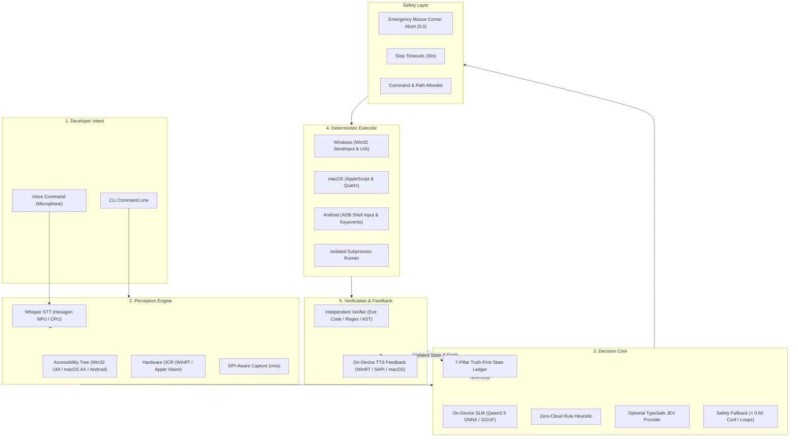
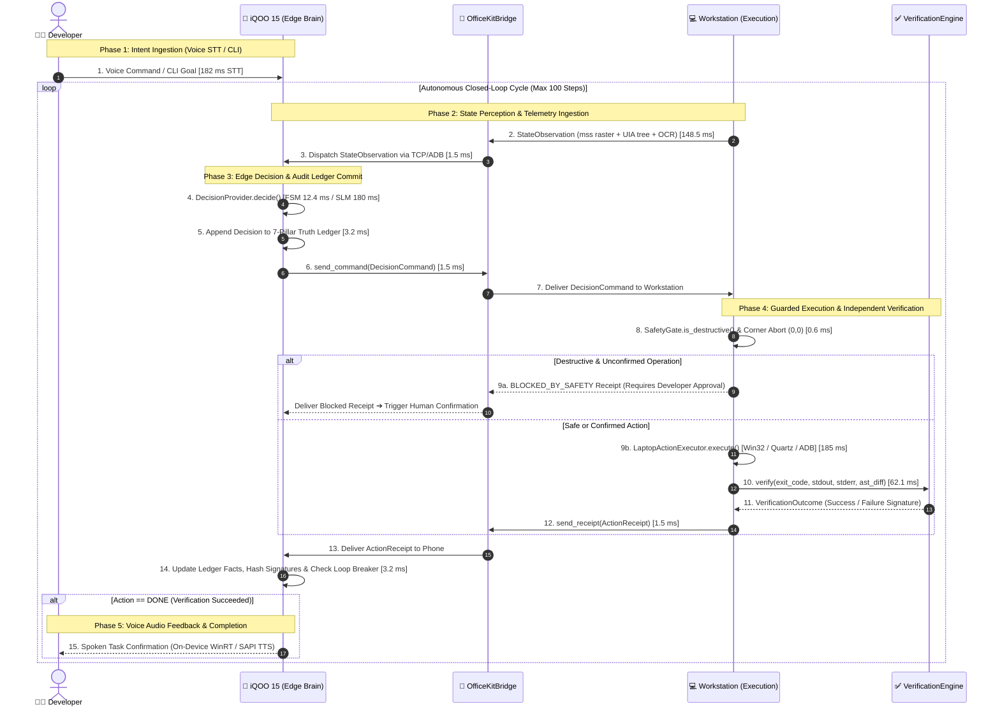

# System Architecture

## Overview

JEVON is architected as a **4-layer, dual-device system** separating intelligence (phone) from execution (laptop), connected by a latency-instrumented Office Kit Bridge.

---

## The Core Control Loop

Traditional developer AI assistants follow a broken open-loop pattern:

```
Developer Intent  ──>  LLM (Cloud)  ──>  Generated Text / Code Snippet
                             ▲                       │
                             │ (Manual copy-paste)   │
                             └───────────────────────┘
```

JEVON replaces this with a **deterministic closed-loop**:

```
Developer Intent
       │
       ▼
   Perceive ──> Structured Decision ──> Deterministic Action ──> Observe ──> Verify
       ▲                                                                       │
       └───────────────────────── Next Decision ───────────────────────────────┘
```

---

## Architecture Diagram



---

## Architectural Layers

### Layer 1 — Developer Intent

The system accepts input via two channels:

- **CLI argument**: Direct text goal (`clicker "open calculator and compute 42 * 2"`)
- **Voice command**: Microphone capture → Whisper STT → transcribed goal

### Layer 2 — Perception Engine

Captures the current state of the developer environment:

| Component | Technology | Platform |
| :--- | :--- | :--- |
| Screen Capture | `mss` with per-monitor DPI scaling | Windows |
| UIAutomation Tree | COM-based UIA tree traversal | Windows |
| Hardware OCR | WinRT OCR with tile-level change cache | Windows |
| Accessibility API | PyObjC `AXUIElement` | macOS |
| Vision OCR | Apple Vision framework | macOS |
| UI Hierarchy | `uiautomator dump` | Android |

### Layer 3 — Decision Core

Evaluates perception data and selects the next action:

| Provider | Type | Cloud Requirement |
| :--- | :--- | :--- |
| `LocalDecisionProvider` | 7-rule deterministic FSM | **Zero** — fully offline |
| `TypeSafeJevProvider` | Cloud classifier + local fallback | Optional API key |
| `SafetyFallback` | Decorator wrapping any provider | None |
| On-device SLM | Qwen 2.5 (0.5B) via ONNX/GGUF | None |

### Layer 4 — Deterministic Executor

Executes the chosen action via native OS APIs:

| Platform | Input Method | Process Execution |
| :--- | :--- | :--- |
| Windows | Win32 `SendInput` + UIAutomation | `subprocess.run()` |
| macOS | AppleScript + Quartz Events | `subprocess.run()` |
| Android | ADB `input tap/text/keyevent` | ADB shell |

### Layer 5 — Verification & Feedback

Validates action outcomes independently:

- Exit code verification (0 = success)
- Regex pattern matching on output
- AST syntax validation (Python)
- Error elimination confirmation
- TTS audio feedback to developer

---

## Dual-Device Separation

The system is explicitly separated into two devices connected by the OfficeKitBridge:

```mermaid
flowchart LR
    subgraph Phone ["iQOO Phone (Intelligence Center)"]
        P_PERC["Perception & Voice"]
        P_DEC["Decision Engine"]
        P_STATE["Truth-First Ledger"]
    end

    subgraph Bridge ["OfficeKitBridge"]
        B_ADB["ADB USB Tunnel"]
        B_SOCK["TCP Socket"]
        B_IPC["Local IPC"]
    end

    subgraph Laptop ["Laptop (Execution)"]
        L_EXEC["Action Executor"]
        L_SAFE["Safety Gate"]
        L_VERIF["Verification Engine"]
    end

    Phone -->|"DecisionCommand"| Bridge
    Bridge -->|"DecisionCommand"| Laptop
    Laptop -->|"ActionReceipt"| Bridge
    Bridge -->|"ActionReceipt"| Phone
    Laptop -->|"StateObservation"| Bridge
    Bridge -->|"StateObservation"| Phone
```



| Role | Device | Responsibilities |
| :--- | :--- | :--- |
| **Intelligence Center** | iQOO Phone / Android | Perception, voice, SLM inference, Truth-First state, decision making |
| **Communication Bridge** | OfficeKitBridge | Bi-directional telemetry exchange with latency instrumentation |
| **Execution Environment** | Windows / ARM64 Laptop | Native OS automation, subprocess execution, independent verification |
| **Standalone Mode** | Single Machine | Both roles via in-memory IPC transport (for CI/CD and testing) |

---

## The 6-Step State Machine

Every cycle follows a strict sequence:

```
 1. SENSE SCREEN ───────> mss raster capture + UIAutomation XML + WinRT OCR
         │
         ▼
 2. BUILD PROMPT ───────> Index interactive controls [0..N], active focus, recent history
         │
         ▼
 3. SELECT ACTION ──────> SLM / Local FSM outputs typed action, target item, & confidence
         │
         ▼
 4. SAFETY CHECK ───────> Verify coordinates != (0,0), action in allowlist, step < 100
         │
         ▼
 5. EXECUTE ────────────> Native Win32 SendInput / ADB input tap / Shell subprocess
         │
         ▼
 6. VERIFY & RECORD ────> Evaluate exit code, regex matching, log to 7-pillar ledger
```

---

## Dual-Device Sequence Diagram

Every developer interaction runs as an instrumented, asynchronous closed-loop cycle across the **iQOO Office Kit Bridge**:



### Telemetry Message Trace

| Step | Telemetry Frame / Event | Channel & Direction | Payload / Operation | Latency Budget | Guardrail / Fallback |
| :---: | :--- | :---: | :--- | :---: | :--- |
| **1** | **Developer Intent** | Workstation / Mic ➔ Phone | Raw PCM audio stream or CLI argument string | **182 ms** | Qualcomm Hexagon NPU Whisper model |
| **2–3** | **`StateObservation`** | Laptop ➔ Bridge ➔ Phone | Screen PNG, active UIA control tree, error trace | **~150 ms** | Direct3D 12 WinRT OCR tile-cache |
| **4** | **Edge Decision** | Phone (Local Inference) | Evaluates 7-rule FSM or Qwen 2.5 SLM (ONNX/GGUF) | **12.4 ms** | Confidence floor $p \ge 0.60$ fallback |
| **5** | **Audit State Commit** | Phone (Truth Ledger) | Appends typed decision + probabilities to ledger | **3.2 ms** | Append-only immutable history |
| **6–7** | **`DecisionCommand`** | Phone ➔ Bridge ➔ Laptop | Typed action, target coordinates/file, parameters | **~1.5 ms** | Transport auto-reconnect retry queue |
| **8** | **Safety Gate Check** | Laptop (Pre-Execution) | Checks mouse pointer $\ne (0,0)$, step count $< 100$ | **0.6 ms** | Immediate hardware interrupt on corner abort |
| **9** | **Deterministic Action** | Laptop ➔ Target OS | Win32 `SendInput`, macOS Quartz, or ADB keyevents | **185.0 ms** | 30-second isolated subprocess ceiling |
| **10–11**| **Objective Verification** | Laptop ➔ Verification Engine | Checks exit code $== 0$, stdout regex, AST diff | **62.1 ms** | Zero self-certification rule |
| **12–13**| **`ActionReceipt`** | Laptop ➔ Bridge ➔ Phone | Execution status, stdout/stderr, verification flag | **~1.5 ms** | Marshaled over USB tunnel or TCP socket |
| **14** | **Ledger Fact Update** | Phone (Truth Ledger) | Records output, computes 16-char SHA-256 error hash | **3.2 ms** | Oscillation loop detection breaker |
| **15** | **Audio TTS Feedback** | Phone ➔ Developer | Local speech synthesizer emits audible confirmation | **Async** | Spoken task completion without context-switching |

---

## Design Principles

1. **Bounded Action Space**: Exactly 8 mutually exclusive actions — prevents infinite text generation
2. **Deterministic Execution**: Every action maps to a concrete OS operation — no ambiguity
3. **Independent Verification**: Never self-certify — always validate via exit codes, regex, AST
4. **Safety-First**: 7 layers of protection from hardware abort to policy allowlists
5. **Truth-First Auditing**: Immutable 7-pillar ledger — every decision, fact, and failure recorded
6. **Zero-Cloud Default**: Full functionality with 0 API keys — cloud is optional escalation
7. **Platform Abstraction**: Single interface, multiple OS backends (Windows/macOS/Android)
8. **Latency Instrumentation**: Nanosecond-precision timing on every pipeline stage
