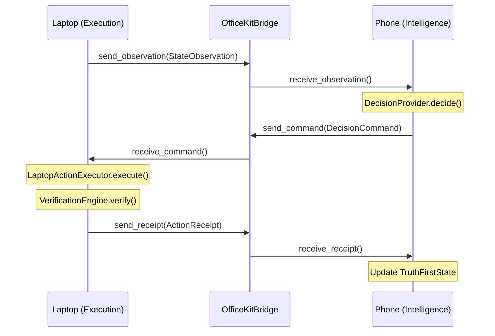

# Office Kit Bridge & Protocol

## Overview

The OfficeKitBridge provides **bi-directional, latency-instrumented communication** between the iQOO phone (intelligence center) and the developer laptop (execution environment). It exchanges strongly-typed telemetry frames over pluggable transport backends.

**Source**: [`jevon/bridge/`](../jevon/bridge/)

---

## Protocol Data Models

Three frozen dataclasses define the telemetry frames exchanged across the bridge:

### 1. `StateObservation` (Laptop → Phone)

Captures the current state of the developer environment:

```python
@dataclass(frozen=True)
class StateObservation:
    session_id: str                    # Unique session identifier
    step_index: int                    # Incremental step counter
    timestamp_ns: int                  # Nanosecond timestamp (auto-generated)
    working_directory: str             # Active workspace root path
    active_file: str | None            # Currently focused/edited file
    terminal_output: str               # Raw stdout/stderr tail from last command
    compiler_exit_code: int | None     # 0=pass, non-zero=error, None=idle
    git_status_summary: str            # Git tree status summary
    recent_error: str | None           # Extracted error message/trace
    metadata: dict[str, Any]           # Custom metadata dictionary
```

**Source**: [`jevon/decision/provider.py`](../jevon/decision/provider.py)

### 2. `DecisionCommand` (Phone → Laptop)

Decision dispatched from the phone's intelligence center to the laptop for execution:

```python
@dataclass(frozen=True)
class DecisionCommand:
    command_id: str                    # Unique command identifier
    session_id: str                    # Session identifier
    step_index: int                    # Step counter
    timestamp_ns: int                  # Nanosecond timestamp
    action: DeveloperAction            # 1 of 8 bounded actions
    confidence: float                  # max(probabilities) ∈ [0.0, 1.0]
    probabilities: dict[str, float]    # All 8 actions summing to 1.0
    parameters: dict[str, Any]         # Action-specific parameters
    requires_confirmation: bool        # Human approval needed (default: False)
```

**Validation** (`__post_init__`):
- String actions are coerced to `DeveloperAction`
- Action must be in the bounded 8-action set
- Confidence must be in `[0.0, 1.0]`

**Source**: [`jevon/bridge/protocol.py`](../jevon/bridge/protocol.py)

### 3. `ActionReceipt` (Laptop → Phone)

Execution result and verification outcome returned from the laptop:

```python
@dataclass(frozen=True)
class ActionReceipt:
    command_id: str                    # Matching command identifier
    session_id: str                    # Session identifier
    step_index: int                    # Step counter
    action: DeveloperAction            # Executed action
    status: str                        # See status codes below
    exit_code: int                     # Process exit code
    stdout: str                        # Captured standard output
    stderr: str                        # Captured standard error
    verification_passed: bool          # Independent verification result
    verification_details: dict         # Per-check breakdown
    duration_ns: int                   # Execution duration in nanoseconds
    timestamp_ns: int                  # Nanosecond timestamp
```

**Valid Status Codes**:

| Status | Meaning |
|:---|:---|
| `SUCCESS` | Action executed and verification passed |
| `FAILED` | Action executed but exit code was non-zero |
| `BLOCKED_BY_SAFETY` | SafetyGate intercepted a destructive command |
| `ABORTED` | Emergency stop triggered (mouse corner abort) |

---

## Transport Layer

Three transport backends implement the `BridgeTransport` abstract interface:

### `BridgeTransport` ABC

```python
class BridgeTransport(ABC):
    def connect(self) -> bool: ...
    def disconnect(self) -> None: ...
    def is_connected(self) -> bool: ...
    def send(self, data: bytes) -> None: ...
    def receive(self, timeout_s: float = 5.0) -> bytes: ...
```

**Source**: [`jevon/bridge/transports.py`](../jevon/bridge/transports.py)

---

### Transport 1: `IpcTransport` (Local In-Memory)

| Property | Value |
|:---|:---|
| **Use Case** | Standalone mode, unit tests, CI/CD |
| **Protocol** | Thread-safe `queue.Queue` |
| **Latency** | Sub-microsecond (in-process) |
| **Thread Safety** | Yes (via `queue.Queue`) |

```python
transport = IpcTransport()
transport.connect()  # Always succeeds
transport.send(b"data")
data = transport.receive(timeout_s=5.0)  # Raises TimeoutError if empty
```

- Two internal queues: `_c2s` (client→server) and `_s2c` (server→client)
- `disconnect()` clears both queues and resets connection state

---

### Transport 2: `SocketTransport` (TCP with Binary Framing)

| Property | Value |
|:---|:---|
| **Use Case** | Wi-Fi Office Kit connection |
| **Protocol** | TCP socket with 4-byte big-endian length prefix |
| **Default Address** | `127.0.0.1:9876` |
| **Thread Safety** | Yes (via `threading.Lock`) |

**Wire Format**:
```
┌──────────────┬──────────────────────────┐
│ 4 bytes (BE) │ N bytes (payload)        │
│ length = N   │ JSON-encoded telemetry   │
└──────────────┴──────────────────────────┘
```

- `send()`: Prepends 4-byte big-endian length header, appends to buffer
- `receive()`: Reads length header, extracts exactly N bytes, polls with 5ms sleep
- Timeout: Raises `TimeoutError` after `timeout_s` seconds

---

### Transport 3: `AdbTunnelTransport` (USB Port Forwarding)

| Property | Value |
|:---|:---|
| **Use Case** | Physical USB cable via ADB |
| **Protocol** | `adb forward tcp:9876 tcp:9876` tunnel |
| **Default Ports** | Local: 9876, Remote: 9876 |
| **Delegation** | Wraps `IpcTransport` internally |

```python
transport = AdbTunnelTransport(local_port=9876, remote_port=9876)
```

- Internally delegates to `IpcTransport` for queue-based send/receive
- Connection state tracks both its own flag and the inner transport

---

## `OfficeKitBridge`

**Source**: [`jevon/bridge/bridge.py`](../jevon/bridge/bridge.py)

The bridge coordinator wraps a transport and provides typed send/receive methods:

### Methods

| Method | Direction | Input/Output | Returns |
|:---|:---|:---|:---|
| `send_observation(obs)` | Laptop → Phone | `StateObservation` | Latency (ns) |
| `receive_observation()` | Phone reads | — | `StateObservation` |
| `send_command(cmd)` | Phone → Laptop | `DecisionCommand` | Latency (ns) |
| `receive_command()` | Laptop reads | — | `DecisionCommand` |
| `send_receipt(receipt)` | Laptop → Phone | `ActionReceipt` | Latency (ns) |
| `receive_receipt()` | Phone reads | — | `ActionReceipt` |

### Latency Instrumentation

Every send operation records elapsed time:
```python
t0 = time.perf_counter_ns()
data = json.dumps(obs.to_dict()).encode("utf-8")
self.transport.send(data)
elapsed_ns = time.perf_counter_ns() - t0
self.latency_records.append({"type": "send_observation", "latency_ns": elapsed_ns})
```

All records are stored in `bridge.latency_records` for post-run analysis.

### Usage

```python
from jevon.bridge.bridge import OfficeKitBridge
from jevon.bridge.transports import IpcTransport, SocketTransport, AdbTunnelTransport

# Standalone mode (CI/CD, testing)
bridge = OfficeKitBridge(IpcTransport())

# Wi-Fi Office Kit
bridge = OfficeKitBridge(SocketTransport(host="192.168.1.100", port=9876))

# USB ADB connection
bridge = OfficeKitBridge(AdbTunnelTransport(local_port=9876, remote_port=9876))

# Connect
bridge.connect()

# Send observation
latency = bridge.send_observation(obs)  # Returns ns

# Receive command
cmd = bridge.receive_command(timeout_s=5.0)

# Send receipt
latency = bridge.send_receipt(receipt)

# Disconnect
bridge.disconnect()
```

---

## Data Flow Diagram



---

## Serialization

All protocol data models support full JSON roundtrip:

```python
# DecisionCommand
cmd_json = cmd.to_json()         # JSON string
cmd_dict = cmd.to_dict()         # Dictionary
cmd = DecisionCommand.from_json(cmd_json)
cmd = DecisionCommand.from_dict(cmd_dict)

# ActionReceipt
receipt_json = receipt.to_json()
receipt = ActionReceipt.from_json(receipt_json)

# StateObservation
obs_dict = obs.to_dict()
obs = StateObservation.from_dict(obs_dict)
```
