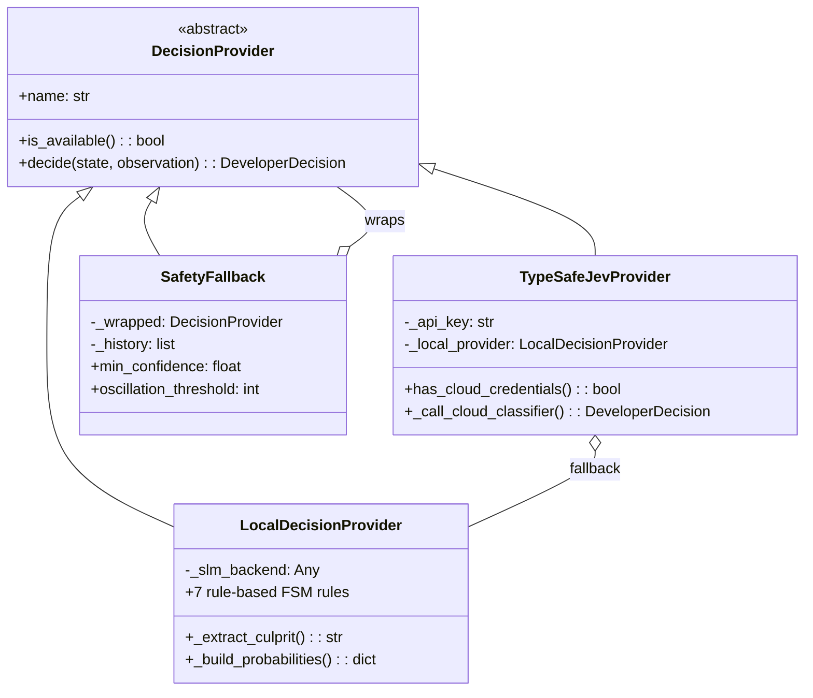
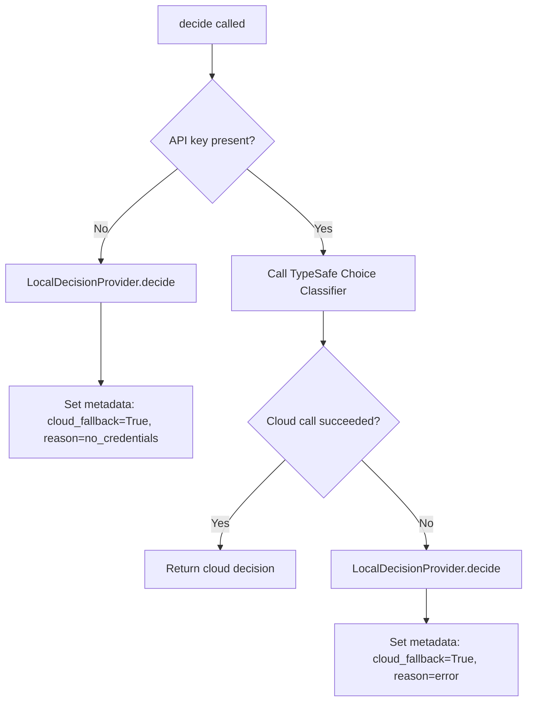

# Decision Engine & Action Space

## Overview

The Decision Engine is the core intelligence module of JEVON. It converts developer state observations into strongly-typed, bounded actions with confidence scores and full probability distributions.

**Source**: [`jevon/decision/`](../jevon/decision/)

---

## The 8-Action Bounded Space

JEVON restricts **all** developer decisions to exactly **8 mutually exclusive actions**, defined as a `StrEnum` in [`actions.py`](../jevon/decision/actions.py):

| # | Action | Enum Value | Description | Terminal? |
|:---:|:---|:---|:---|:---:|
| 1 | `INSPECT_ERROR` | `inspect_error` | Parse compiler/test error trace to identify culprit file and line | No |
| 2 | `INSPECT_FILE` | `inspect_file` | Read source code context around the failing line | No |
| 3 | `RUN_TARGETED_TEST` | `run_targeted_test` | Execute the specific failing test to verify a fix | No |
| 4 | `RERUN_BUILD` | `rerun_build` | Rerun the full project build/test suite | No |
| 5 | `INSPECT_RECENT_CHANGE` | `inspect_recent_change` | Inspect git diff to find recently introduced regressions | No |
| 6 | `APPLY_FIX` | `apply_fix` | Apply a targeted code patch to the culprit file | No |
| 7 | `REQUEST_CONFIRMATION` | `request_confirmation` | Pause execution and request human developer approval | No |
| 8 | `DONE` | `done` | Task complete — terminates the decision loop | **Yes** |

### Why Bounded?
- **Prevents infinite text generation** — unlike chatbot outputs, every action maps to a concrete operation
- **Enables probability distributions** — confidence can be split across exactly 8 candidates
- **Makes safety analysis tractable** — every possible action can be pre-analyzed for safety
- **Supports deterministic FSM** — finite state transitions between known actions

---

## `DeveloperDecision` Dataclass

Every decision output is a strongly typed object:

```python
@dataclass
class DeveloperDecision:
    action: DeveloperAction          # One of the 8 bounded actions
    confidence: float                # [0.0, 1.0] — clamped, NaN/Inf → 0.0
    probabilities: dict[str, float]  # All 8 actions summing to exactly 1.0
    parameters: dict[str, Any]       # Action-specific params (target_file, test_command, etc.)
    metadata: dict[str, Any]         # Diagnostic audit metadata (reasoning, provider_name)
```

### Key Properties

| Property | Return Type | Logic |
|:---|:---|:---|
| `is_terminal` | `bool` | `True` only when `action == DONE` |
| `requires_confirmation` | `bool` | `True` when confidence < 0.60, action is `REQUEST_CONFIRMATION`, or metadata flags `destructive` |

### Validation (in `__post_init__`)
- String actions are coerced to `DeveloperAction` enum
- Invalid actions raise `ValueError`
- Confidence is clamped to `[0.0, 1.0]` — NaN/Inf become 0.0
- Probabilities are normalized to sum to exactly 1.0

### Serialization
- `to_dict()` / `from_dict()` — dictionary roundtrip
- `to_json()` / `from_json()` — JSON string roundtrip

---

## Probability Normalization

The `normalize_probabilities()` function guarantees mathematical invariants:

```python
def normalize_probabilities(probs: dict) -> dict[str, float]:
```

**Guarantees:**
1. All 8 actions are present in the output
2. All values are non-negative
3. Sum equals **exactly** 1.0 (floating-point residual adjusted on the max key)
4. NaN/Inf/zero-sum inputs produce a uniform fallback: `1/8 = 0.125` each

---

## Decision Provider Architecture



---

## Provider 1: `LocalDecisionProvider`

**Source**: [`local_provider.py`](../jevon/decision/local_provider.py)  
**Cloud requirement**: **None** — operates 100% offline with zero API keys

### 7-Rule Finite State Machine

| Priority | Rule | Trigger Condition | Chosen Action | Confidence |
|:---:|:---|:---|:---|:---:|
| 0 | **Loop Guard** | Repeated failure signatures **or** oscillation detected | `REQUEST_CONFIRMATION` | 0.95 |
| 1 | **Test Passed** | Last action was `RUN_TARGETED_TEST` **and** exit code == 0 | `RERUN_BUILD` | 0.92 |
| 2 | **Fix Applied** | Last action was `APPLY_FIX` | `RUN_TARGETED_TEST` | 0.94 |
| 3 | **Clean Build** | Exit code == 0, no errors, at least one prior decision **or** "passed" in output | `DONE` | 0.98 |
| 4 | **Error + Culprit Known** | Error present, culprit file identified, last action was `INSPECT_ERROR` | `INSPECT_FILE` | 0.89 |
| 5 | **File Inspected** | Error present, culprit identified, last action was `INSPECT_FILE` | `APPLY_FIX` or `INSPECT_RECENT_CHANGE` | 0.85–0.88 |
| 6 | **Error Present** | Error or non-zero exit code, culprit unknown | `INSPECT_ERROR` | 0.91 |
| 7 | **Default** | No errors, initial/idle state | `RERUN_BUILD` | 0.85 |

### Culprit File Extraction

The provider uses regex patterns to extract the failing file from error output:

| Pattern | Matches | Example |
|:---|:---|:---|
| `File "([^"]+\.py)", line (\d+)` | Python tracebacks | `File "calc.py", line 42` |
| `FAILED\s+([^\s:]+\.py)` | Pytest failure lines | `FAILED tests/test_calc.py::test_add` |
| `([path]+\.(?:py\|rs\|ts\|js)):(\d+)` | Generic file:line patterns | `src/main.rs:127` |

### Probability Distribution Construction

For each decision, remaining probability mass (`1.0 - confidence`) is distributed:
- **With secondary weights**: proportionally across specified alternative actions
- **Without**: uniformly across the 7 non-chosen actions

---

## Provider 2: `TypeSafeJevProvider`

**Source**: [`jev_provider.py`](../jevon/decision/jev_provider.py)  
**Cloud requirement**: Optional (`TYPESAFE_API_KEY`)

### Behavior



### Cloud Classifier
When API key is available, the provider:
1. Constructs a prompt context from goal, exit code, active file, error, and terminal output
2. Creates a TypeSafe `Choice` with criteria descriptions for all 8 actions
3. Calls `client.system_one()` with the bounded criteria
4. Extracts action, confidence, and probabilities from the response
5. Returns a normalized `DeveloperDecision`

---

## Provider 3: `SafetyFallback` (Decorator)

**Source**: [`safety_fallback.py`](../jevon/decision/safety_fallback.py)  
**Pattern**: Decorator/wrapper — wraps any `DecisionProvider`

### Safety Guards (in execution order)

#### Guard 1: Precondition — APPLY_FIX
- **Check**: `target_file` must be specified in parameters or observation
- **Override**: Redirects to `INSPECT_FILE` or `INSPECT_ERROR`
- **Metadata**: `safety_override: "missing_target_file"`

#### Guard 2: Precondition — RUN_TARGETED_TEST
- **Check**: `target_test` must be specified
- **Override**: Falls back to `RERUN_BUILD` (full test suite)
- **Metadata**: `safety_override: "missing_test_target"`

#### Guard 3: Low Confidence (< 0.60)
- **Check**: `decision.confidence < min_confidence`
- **Override**:
  - If unparsed error exists → `INSPECT_ERROR` (confidence 0.85)
  - Otherwise → `REQUEST_CONFIRMATION` (confidence 0.85)
- **Metadata**: `safety_override: "low_confidence"`, preserves original action and confidence

#### Guard 4: Oscillation Detection
Detects three types of repetitive behavior:

| Type | Pattern | Example |
|:---|:---|:---|
| **Single-action stagnation** | A → A → A (configurable window) | `inspect_error` × 3 |
| **2-cycle periodic** | A → B → A → B | `inspect_error` → `inspect_file` × 2 |
| **3-cycle periodic** | A → B → C → A → B → C | Three distinct actions repeating |

- **Override**: `REQUEST_CONFIRMATION` (confidence 0.95)
- **Exception**: `DONE` actions are never intercepted
- **History**: Capped at 50 entries to prevent memory growth

---

## `StateObservation` Contract

The input observation from the developer environment:

```python
@dataclass(frozen=True)
class StateObservation:
    session_id: str = ""              # Unique session identifier
    step_index: int = 0               # Incremental step counter
    timestamp_ns: int                 # Nanosecond timestamp (auto-generated)
    working_directory: str = ""       # Active workspace root path
    active_file: str | None = None    # Currently focused/edited file
    terminal_output: str = ""         # Raw stdout/stderr from last command
    compiler_exit_code: int | None    # 0=pass, non-zero=error, None=idle
    git_status_summary: str = ""      # Git tree status
    recent_error: str | None = None   # Extracted error message/trace
    metadata: dict[str, Any]          # Custom metadata dictionary
```

---

## Usage Example

```python
from jevon.decision.local_provider import LocalDecisionProvider
from jevon.decision.safety_fallback import SafetyFallback
from jevon.decision.provider import StateObservation
from jevon.truth_first.state import TruthFirstState

# Create provider chain: Local FSM wrapped with Safety Fallback
provider = SafetyFallback(LocalDecisionProvider())

# Create state and observation
state = TruthFirstState(goal="Fix failing test in calc.py")
obs = StateObservation(
    compiler_exit_code=1,
    recent_error='File "calc.py", line 42\n  SyntaxError: unexpected indent',
    terminal_output="FAILED tests/test_calc.py::test_add"
)

# Get decision
decision = provider.decide(state, obs)
print(f"Action: {decision.action}")          # inspect_error
print(f"Confidence: {decision.confidence}")  # 0.91
print(f"Probabilities: {decision.probabilities}")  # All 8 summing to 1.0
```
