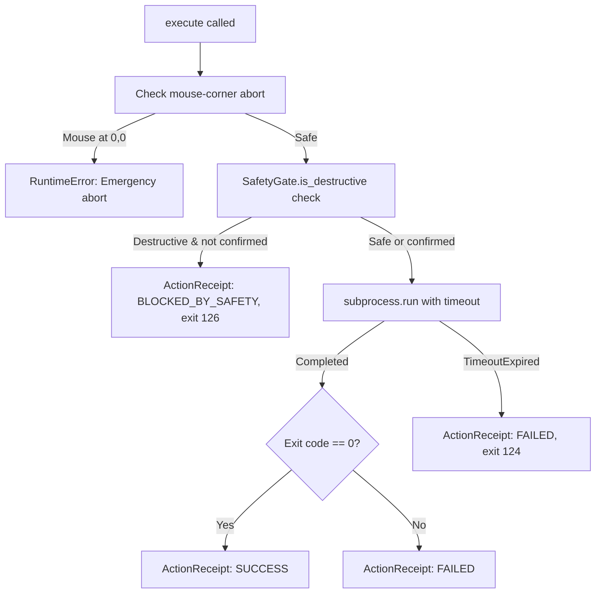

# Execution & Safety Layer

## Overview

The Execution & Safety Layer handles the deterministic execution of developer commands on the laptop, with multiple safety mechanisms to prevent runaway automation and destructive operations.

**Source**: [`jevon/execution/`](../jevon/execution/)

---

## `LaptopActionExecutor`

**Source**: [`jevon/execution/executor.py`](../jevon/execution/executor.py)

Executes shell commands with subprocess isolation, step timeout, mouse-corner failsafe, and SafetyGate integration.

### Constructor

```python
executor = LaptopActionExecutor(working_directory="/path/to/project")
```

If `working_directory` is not specified, defaults to `os.getcwd()`.

### `execute()` Method

```python
def execute(
    self,
    command_str: str,
    timeout_s: float = 30.0,        # STEP_TIMEOUT_SECONDS
    mouse_pos: tuple | None = None,  # For corner abort check
    confirmed: bool = False,         # Override SafetyGate for destructive commands
) -> ActionReceipt:
```

### Execution Flow



### Return Values

| Scenario | Status | Exit Code | Verification |
|:---|:---|:---:|:---|
| Command succeeds | `SUCCESS` | 0 | `passed=True` |
| Command fails | `FAILED` | Non-zero | `passed=False` |
| Safety blocked | `BLOCKED_BY_SAFETY` | 126 | `passed=False` |
| Timeout expired | `FAILED` | 124 | `passed=False` |
| Corner abort | RuntimeError raised | — | — |

---

## `SafetyGate`

**Source**: [`jevon/execution/safety_gate.py`](../jevon/execution/safety_gate.py)

Intercepts and blocks destructive commands until human confirmation.

### Destructive Patterns (7 regex rules)

| # | Pattern | Matches | Risk |
|:---:|:---|:---|:---|
| 1 | `git\s+reset\s+--hard` | Hard git resets | Complete uncommitted work loss |
| 2 | `git\s+clean\s+-[a-zA-Z]*f` | Force git clean | Untracked file deletion |
| 3 | `rm\s+(-rf\|-fr).*` | Recursive force delete (Unix) | Directory tree destruction |
| 4 | `rmdir\s+/s\s+/q` | Recursive quiet delete (Windows) | Directory tree destruction |
| 5 | `del\s+/f\s+/q` | Force quiet delete (Windows) | File destruction |
| 6 | `.env\|id_rsa\|credentials\|.pem` | Sensitive file access | Credential exposure |
| 7 | `drop\s+database` | Database drop command | Data destruction |

### `is_destructive()` Method

```python
SafetyGate.is_destructive("git reset --hard HEAD~3")
# Returns: (True, "Matched destructive safety rule: git\\s+reset\\s+--hard")

SafetyGate.is_destructive("pytest tests/")
# Returns: (False, "")
```

### `is_allowed()` Method

```python
SafetyGate.is_allowed("pytest tests/test_calc.py")
# Returns: True (matches "pytest" prefix)

SafetyGate.is_allowed("rm -rf /")
# Returns: False (no matching allowed prefix)
```

---

## Command Allowlist

**Source**: [`jevon/execution/allowlist.py`](../jevon/execution/allowlist.py)

### Allowed Command Prefixes

```python
ALLOWED_COMMAND_PREFIXES = (
    "python",
    "python3",
    "uv run",
    "pytest",
    "git status",
    "git diff",
    "git log",
    "cargo test",
    "cargo build",
    "npm test",
    "pytest tests",
    "python e2e/runner.py",
)
```

### Execution Bounds

| Constant | Value | Purpose |
|:---|:---|:---|
| `ABORT_CORNER_PX` | `10` | Mouse must be within 10px of (0,0) to trigger emergency stop |
| `STEP_TIMEOUT_SECONDS` | `30` | Maximum execution time per subprocess command |

---

## Desktop Automation Safety (`typesafe_computer_use/actions.py`)

The desktop automation layer includes additional safety mechanisms:

### Emergency Corner Abort
```python
# In actions.py - checked before every click/type
if mouse_pos.x <= ABORT_CORNER_PX and mouse_pos.y <= ABORT_CORNER_PX:
    raise RuntimeError("Abort: Emergency mouse-corner stop triggered")
```

Move your mouse to the **top-left corner (0,0)** of any display to immediately halt all automation.

### Accessibility-First Execution
```python
def click_item(item, screen):
    ref = screen.ax_refs.get(item.index)
    if ref is not None and macos.ax_press(ref):
        return "pressed via accessibility"    # Preferred: native accessibility
    macos.click_at(screen.to_points(item))    # Fallback: pixel clicking
```

Accessibility API presses are preferred over pixel clicks because they:
- Work even when the element is covered by overlays
- Don't depend on exact pixel coordinates
- Are more reliable across DPI scaling changes

### Field Value Verification
After typing text into a field, the system reads back the value to confirm:
```python
if macos.ax_set_value(ref, text):
    back = macos.ax_value(ref)
    if back is not None and back.endswith(text):
        return "via accessibility"  # Confirmed
```

### Noop Detection
Actions that fail to execute are tracked:
```python
NOOP_MARKERS = ("refused", "failed", "waited")

def is_noop(description: str) -> bool:
    return any(marker in description for marker in NOOP_MARKERS)
```

---

## Usage Example

```python
from jevon.execution.executor import LaptopActionExecutor

executor = LaptopActionExecutor(working_directory="C:/projects/myapp")

# Safe command — executes normally
receipt = executor.execute("pytest tests/test_calc.py")
print(receipt.status)      # "SUCCESS" or "FAILED"
print(receipt.exit_code)   # 0 or non-zero
print(receipt.stdout)      # Test output

# Destructive command — blocked by SafetyGate
receipt = executor.execute("git reset --hard HEAD~5")
print(receipt.status)      # "BLOCKED_BY_SAFETY"
print(receipt.exit_code)   # 126
print(receipt.stderr)      # "Action blocked by SafetyGate: Matched destructive safety rule..."

# Destructive command with confirmation — executes
receipt = executor.execute("git reset --hard HEAD~5", confirmed=True)
print(receipt.status)      # "SUCCESS" or "FAILED"
```
